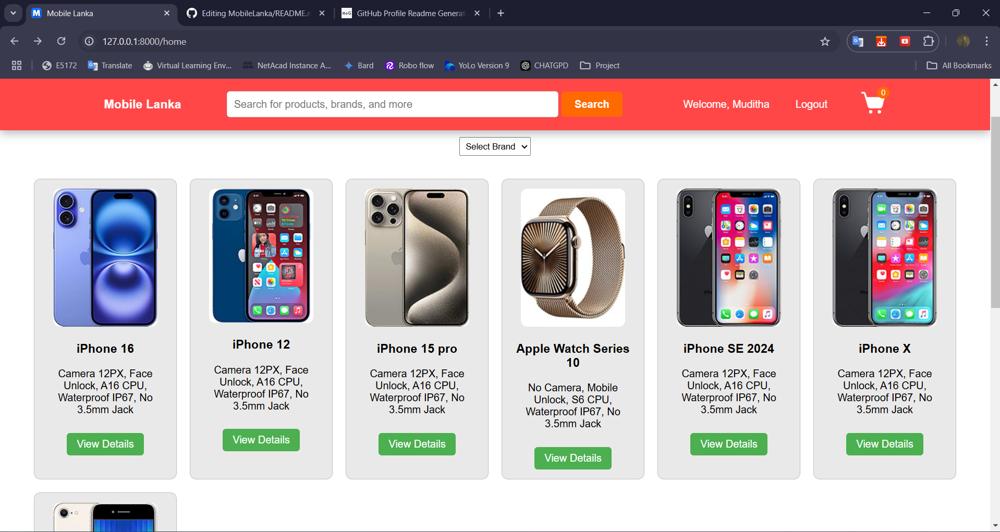
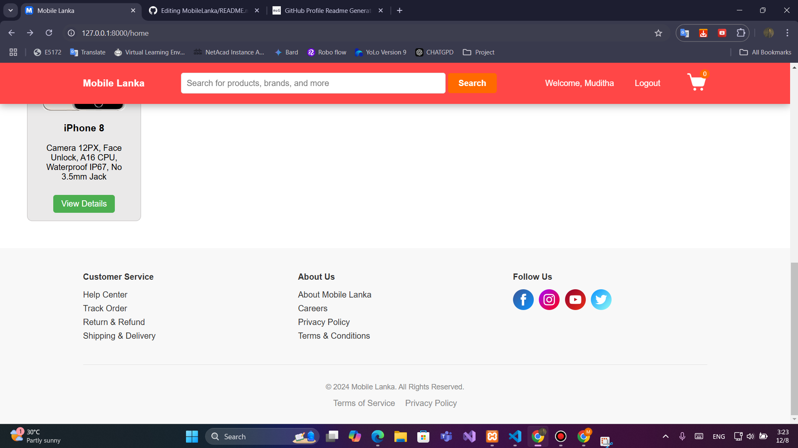
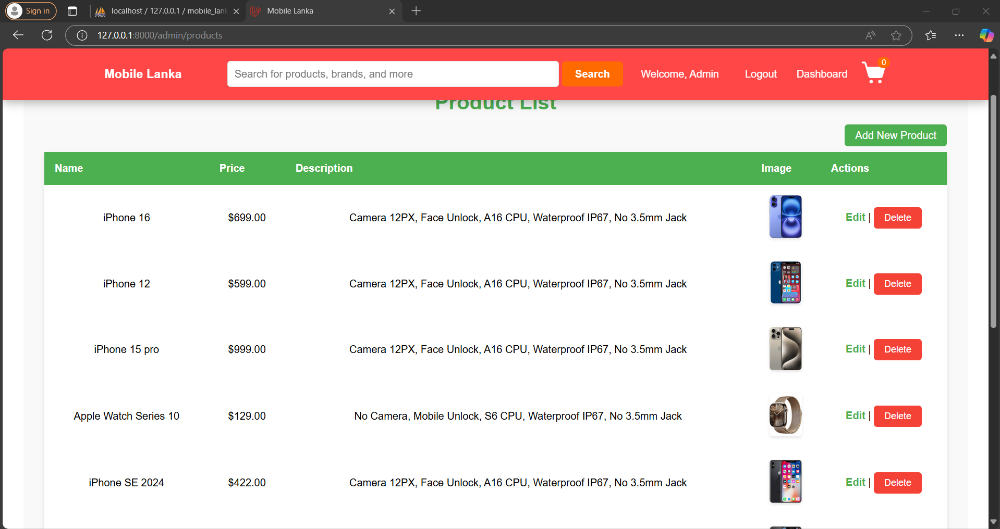

# 📱 Mobile Lanka

Welcome to **Mobile Lanka**, a Laravel-based mobile phone selling application! This project empowers users to explore and purchase mobile phones, while admins can efficiently manage the product catalog.

---

## 🌟 Features

- **User Features**:
  - 🛒 Browse available mobile phones.
  - 🛍️ Add products to the cart and make purchases.
  - 🔒 Secure user authentication for seamless access.
- **Admin Features**:
  - 🔧 Manage product inventory (Add, Edit, Delete).
  - 💵 Update product details like price and specifications.
  - 📋 Oversee user orders and application settings.

---

## 🌟 Folder Structure

 - Mobile-Lanka/
 - ├── app/                            # Application core logic
 - │   ├── Console/                    # Custom Artisan commands
 - │   ├── Exceptions/                 # Application exceptions
 - │   ├── Http/
 - │   │   ├── Controllers/            # Controllers (e.g., AdminController, UserController)
 - │   │   ├── Middleware/             # Middleware classes
 - │   └── Models/                     # Eloquent models (e.g., User.php, Product.php)
 - │
 - ├── database/                       # Database-related files
 - │   ├── migrations/                 # Database migrations
 - │   ├── seeders/                    # Database seeders (e.g., AdminSeeder.php)
 - │   └── factories/                  # Model factories for seeding data
 - │
 - ├── public/                         # Publicly accessible files
 - │   ├── css/                        # CSS files
 - │   └── images/                     # Images (e.g., logos, product images)
 - │
 - ├── resources/                      # Frontend resources
 - │   └── views/                      # Blade templates
 - │       ├── admin/                  # Admin-specific views (e.g., dashboard, manage products)
 - │       ├── auth/                   # Authentication views (login, register)
 - │       ├── layouts/                # Layout files (e.g., app.blade.php)
 - │       ├── products/               # Product views (e.g., index, show)
 - │       └── users/                  # User-specific views (e.g., profile, orders)
 - │
 - ├── routes/                         # Route definitions
 - │   └── web.php                     # Web routes
 - │ 
 - ├── storage/                        # Storage for logs, uploads, etc.
 - │   ├── app/
 - │   ├── framework/
 - │   └── logs/
 - │
 - └── .env                            # Environment variables

---

## 📚 Technologies Used

- **Framework**: Laravel
- **Frontend**: Blade Templates, Bootstrap, CSS, JavaScript
- **Database**: MySQL

---

## 🚀 Getting Started

### Prerequisites

- PHP (>= 8.0)
- Composer
- MySQL

### 🔑 Admin Login Details
- **Email:** abcd@gmail.com
- **Password:** 12345678

----

### 🔑 ScreenShot

⭐ Don't forget to give the repo a star if you found it useful! 🌟
